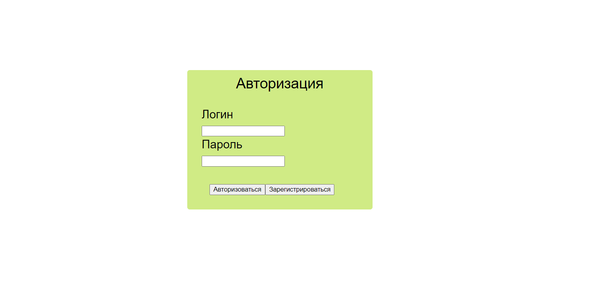
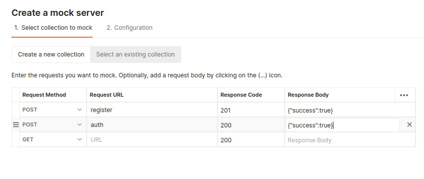
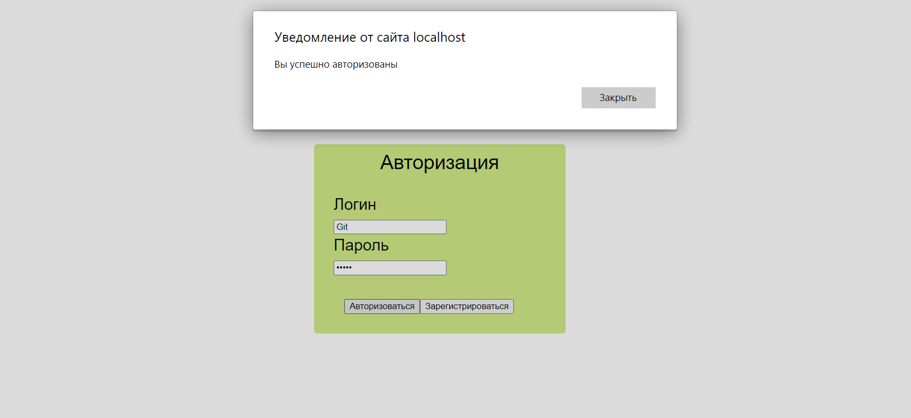
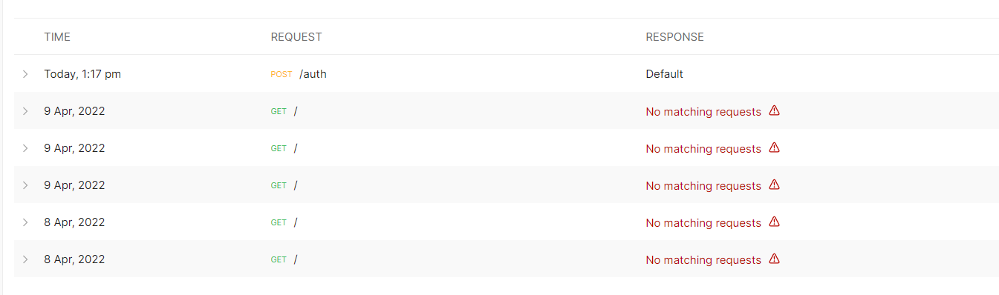

ФЕДЕРАЛЬНОЕ ГОСУДАРСТВЕННОЕ БЮДЖЕТНОЕ 

ОБРАЗОВАТЕЛЬНОЕ УЧРЕЖДЕНИЕ ВЫСШЕГО ОБРАЗОВАНИЯ

«ВЯТСКИЙ ГОСУДАРСТВЕННЫЙ УНИВЕРСИТЕТ» 

Институт математики и информационных систем

Факультет автоматики и вычислительной техники

Кафедра систем автоматизации управления

 
 
 
 
 
 
 
 
 

<strong> Отчет по лабораторной работе №3 </strong>

по дисциплине

«Web-программирование»

 
 
 
 
 
 

Выполнил: студент гр. ИТб-2301-01-00 _________/Корякина К.Д./

Проверил: ст. преподаватель каф. САУ__________/Земцов М.А./

 
 
 
 
 
 
 

Киров 2022

 
 
 
 
 
 
 
 

Цель лабораторной работы: реализовать авторизацию и регистрацию пользователя при помощи post и get запросов к mock server postman.

 

Задачи:

1)Разработать форму авторизации и регистрации

2)Создать сервер

3)Реализовать post и get запрос к серверу

 

Разработать форму авторизации и регистрации.

В результате работы была разработа форма авторизации и регистрации, которая представлена на рисунке 1.

Рисунок 1 - Результат работы

Создать сервер

В результате работы был создан mock server postman, реализован шаблон post и get запросов.

Рисунок 2 - mock server

Рисунок 3 - Авторизация пользователя

Рисунок 4 - Запросы на сервере

Вывод: в ходе лабораторной работы был создан mock server postman, реализован шаблон post и get запросов.

