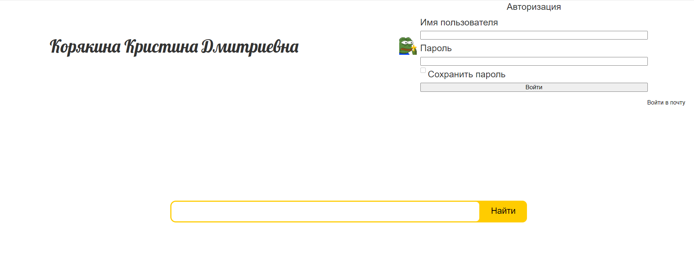

ФЕДЕРАЛЬНОЕ ГОСУДАРСТВЕННОЕ БЮДЖЕТНОЕ 

ОБРАЗОВАТЕЛЬНОЕ УЧРЕЖДЕНИЕ ВЫСШЕГО ОБРАЗОВАНИЯ

«ВЯТСКИЙ ГОСУДАРСТВЕННЫЙ УНИВЕРСИТЕТ» 

Институт математики и информационных систем

Факультет автоматики и вычислительной техники

Кафедра систем автоматизации управления

 
 
 
 
 
 
 
 
 

<strong> Отчет по лабораторной работе №1,2 </strong>

по дисциплине

«Web-программирование»

 
 
 
 
 
 

Выполнил: студент гр. ИТб-2301-01-00 _________/Корякина К.Д./

Проверил: ст. преподаватель каф. САУ__________/Земцов М.А./

 
 
 
 
 
 
 

Киров 2022

 
 
 
 
 
 
 
 

Цель лабораторной работы: изучение Vue.

 

Задачи:

1)Подключить веб-фреймворк VUE

2)Разобраться с предназначением и подключить сборщик модулей Webpack

3)Разобраться с предназначением и встроить в проект инструмент статического анализа кода ESLint

4)Подключить и изучить библиотеку Axios

5)Ознакомиться с языком программирования TypeScript

6)Вывести ФИО автора

7)С помощью Axios вывести страницу сайта

8)Разработать страницу авторизации по заданному варианту

9)Разместить компоненты трёх пакетов на одной странице

 

Подключить веб-фреймворк VUE.

Для ускорение рабочего процесса при работе с Vue.js было использовано Vue CLI 3. 
Vue CLI представляет собой набор инструментов для быстрого прототипирования, 
легкого создания новых приложений и эффективного управления проектами на Vue.js. 
С помощью команды npm install -g @vue/cli было установленно само приложение, а с помощью команды vue create был создан пакет с предварительной настройкой параметров, одним из самых важных параметров был TypeScript. 

Разобраться с предназначением и подключить сборщик модулей Webpack.

Webpack — это инструмент, позволяющий компилировать модули JavaScript, также известные как сборщик модулей. 
Учитывая большое количество файлов, он создает один файл (или несколько файлов), который запускает приложение.
Для того, чтобы установить сборщик модулей использовалась команда vue init webpack.

Разобраться с предназначением и встроить в проект инструмент статического анализа кода ESLint.

При настройки Webpack существует возможность подключения ESLint. ESLint - специальное приложение, 
которое позволяет отслеживать отклонения от общего стиля написания кода JavaScript.
С помощью команды npm install удалось установить зависимости в проект.

Подключить и изучить библиотеку Axios.

Axios — это широко известная JavaScript-библиотека. Она представляет собой HTTP-клиент, основанный на промисах и предназначенный для браузеров и для Node.js.
К текущему проекту была подключена библиотека Axios с помощью команды npm install axios.

Ознакомиться с языком программирования TypeScript.

TypeScript — это язык программирования, в котором исправлены многие недостатки JavaScript. 
TypeScript является надмножеством языка JavaScript. TypeScript включает функции кода, несовместимые с браузером.

В процессе работы был сформирован Vue пакет под названием vue-master, куда были добавлены компоненты LoginForm.vue, PageView.vue, UserInfo.vue из соответствующих пакетов. 
Результат работы представлен на Рисунке 1.

[pic1]: lab12/pic1.jpg
![pic1][pic1]

Рисунок 1 - Результат работы

На Рисунке 2 представлен результат работы в мобильной версии.

Рисунок 2 - Мобильная версия

Вывод: в ходе лабораторной работы были изучены: приложение Vue CLI,  сборщик модулей Webpack, библиотека Axios, язык программирования TypeScript. 
С помощью перечисленных компонентов на практике реализовано отображение на странице фамилии, имени, отчества, сайта ВятГУ и страницы авторизации.

