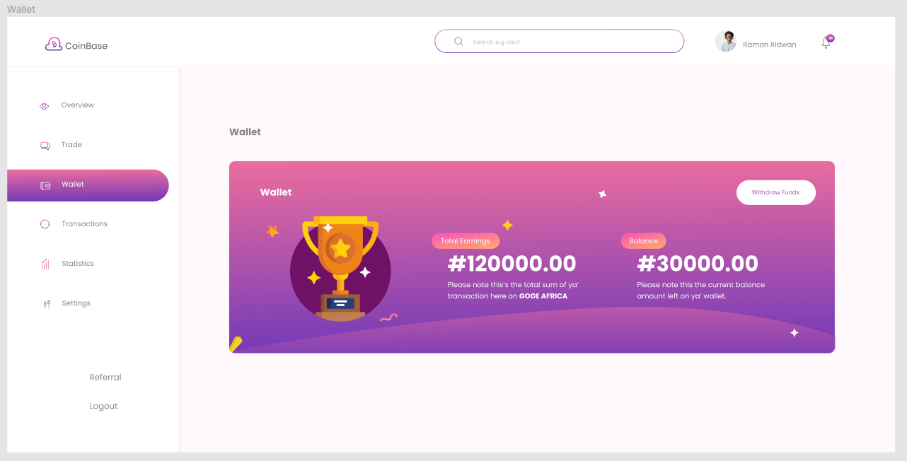
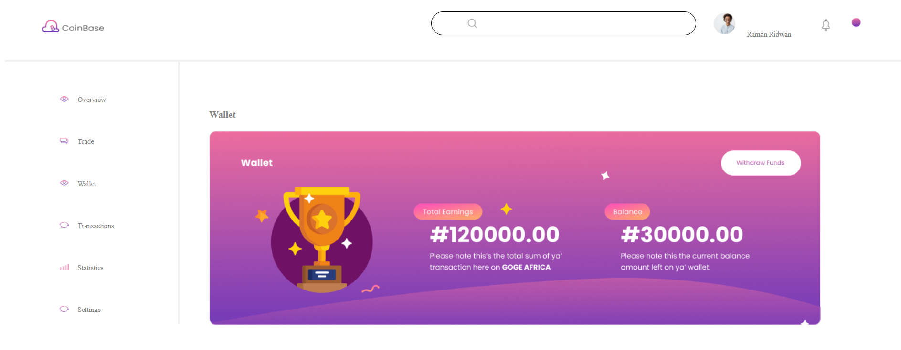

ФЕДЕРАЛЬНОЕ ГОСУДАРСТВЕННОЕ БЮДЖЕТНОЕ 

ОБРАЗОВАТЕЛЬНОЕ УЧРЕЖДЕНИЕ ВЫСШЕГО ОБРАЗОВАНИЯ

«ВЯТСКИЙ ГОСУДАРСТВЕННЫЙ УНИВЕРСИТЕТ» 

Институт математики и информационных систем

Факультет автоматики и вычислительной техники

Кафедра систем автоматизации управления

 
 
 
 
 
 
 
 
 

<strong> Отчет по лабораторной работе №4 </strong>

по дисциплине

«Web-программирование»

 
 
 
 
 
 

Выполнил: студент гр. ИТб-2301-01-00 _________/Корякина К.Д./

Проверил: ст. преподаватель каф. САУ__________/Земцов М.А./

 
 
 
 
 
 
 

Киров 2022

 
 
 
 
 
 
 
 

Цель лабораторной работы: верстка сайта

 

Задачи:

1)Выбрать макет из предложенных Figma community

2)Разделить макет на компонеты

3)Сверстать dashboard

 

Выбрать макет из предложенных Figma community.

Изучив представленные макеты, я выбрала наиболее подходящий. Выбранный макет представлен на Рисунке 1.

Рисунок 1 - Макет

Разделить макет на компонеты.

Представленный ранее макет я разделила на три части. Первая включает в себе header, вторая боковое меню и последняя включает блок с основной инфомацией сайта. Все три компонента были соединены в App.vue.

Сверстать dashboard

По макету был сверстан сайт, который представлен на Рисунке 2.

Рисунок 2 - Сайт

Вывод: в ходе лабораторной работы был выбран макет, разделен на компонеты и реализован.

